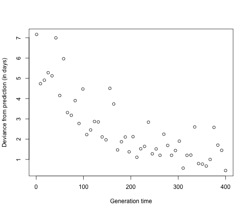

### Hart NCEAS Outline 

Range shifts are one of the best documented consequences of global climate change.  Two key factors influence expansion and contraction of species ranges. On the Northern boundary species may expand as new thermal niches open up due to warming, or may be pushed because of competition from new invaders. At the southern boundary of a range, a species may be forced to shift its range due to conitions warming outside of its thermal tolerances.  Ecologists have spent more than a decade developing bioclimate envelope models to predict how species' ranges will shift under the abiotic conditions expected with climate change.  Two important caveats are often included in these models:  they ignore species interactions and adaptive responses.  

**Goal:** To detect the influence of adapation on species range shifts using a meta-analysis

Species with shorter generation times can evolve more quickl.  They can make use of standing additive genetic variation and higher mutation rates per unit time. Therefore 

**Hypothesis:** Species with shorter generation times will have a greater deviance from predicted niche models than species with longer generation times.

One hypothetical prediction would look like this:

 

In order to extract data for these analyses we want to develop an automated figure extraction tool.  This would allow the creation of an open database that could store information about past data that is not publicly available.  Our main task would be to build the web back-end processing (in python) and a simple front end that would be hosted and stored an existing data repository.  This would leave a tool available to assist in meta-analysis long past the time we use it for this idea.

The end product would therefore be two-fold.  **1** A publication examining the influence of adaptation on range shifts and  **2** a web-based tool for the rapid extraction of data from the existing literature.

